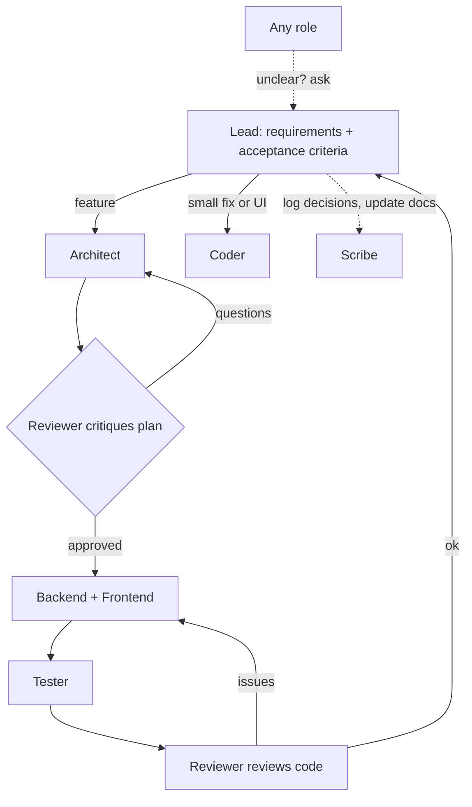

# Learning AI Agent "Squads" with Built-in Cursor

This repo is a hands-on sandbox for learning the AI agent "squad" concept using
built-in Cursor features (role charters as rules + subagent delegation). The
squad itself builds this app - a **Job Application Tracker** - starting with its
own thin skeleton, so you can watch the agents collaborate from minute one.

## Approach
The squad builds everything (even its own skeleton). The only manual setup is the
empty container and the team definition (the role charters in `.cursor/rules/`).

## The squad (7 roles)
- **Lead / coordinator** - owns requirements + acceptance criteria, routes work, manages hand-offs; does not design or code. Escalates to the user when not ~95% sure how to answer a role's question.
- **Architect** - plans real features; skipped for small fixes/UI.
- **Backend** - Node + TS API/logic. Must understand and agree with the architecture before coding.
- **Frontend** - React + TS UI. Must understand and agree with the architecture before coding.
- **Tester** - writes tests; confirms understanding first and covers non-trivial/edge scenarios.
- **Reviewer / Critic** - gates twice: critiques the Architect's plan, then reviews the diff.
- **Scribe / Documentarian** - records decisions and keeps docs/memory current; no feature code.

### Shared principle
Every role confirms it understands its task before acting; if unclear, it returns to the Lead with follow-up questions instead of guessing.

### Flow

## Cursor building blocks
- **Rules** (`.cursor/rules/*.mdc`) - each role's charter, committed so the team persists.
- **Subagent delegation** - the Lead spawns role-specialized helper subagents.
- **Multitask Mode / parallel agents** - Backend + Frontend run concurrently.

## The project: Job Application Tracker
- `frontend/` React + TS (Vite); `backend/` Node + TS API (in-memory first); `shared/` types.
- Feature slices:
  - Applications CRUD (backend)
  - Status pipeline / kanban view (frontend)
  - Reminder / follow-up logic (backend, very testable -> first feature slice)
  - Stats dashboard (frontend)

## Steps
0. **Container** - create the folder + `git init`; document the design here in `PLAN.md`.
1. **Define the team** - write `.cursor/rules/*.mdc` charters (project-scoped only).
2. **First squad run** - Lead delegates to Backend + Frontend subagents in parallel to build the thin skeleton (workspaces root, Express `/health`, Vite shell, shared types); Reviewer sanity-checks; verify `npm run dev`.
3. **Second squad run (full ceremony)** - reminder/follow-up logic: Lead -> Architect plans -> Reviewer critiques -> Backend implements -> Tester tests -> Reviewer reviews.
4. **Remaining slices** - applications CRUD + kanban (parallel Backend+Frontend), then stats dashboard.
5. **Review & lessons** - read diffs; capture hand-off quality and role scope notes.

## Notes
- "Squad runs" in native Cursor = the Lead agent delegating to subagents, guided by the rule charters.
- With delegation you mostly see ONE chat window; subagents report back inline. Use Multitask Mode for a true multi-window parallel feel.
