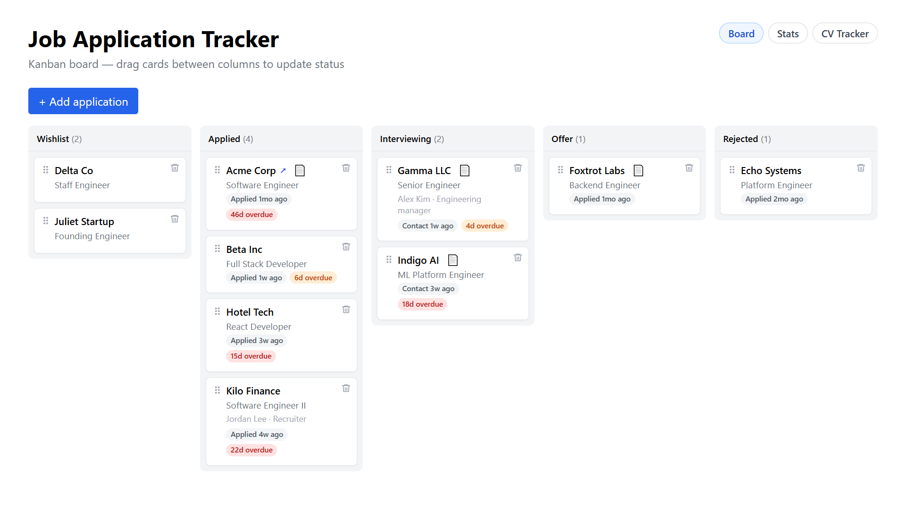
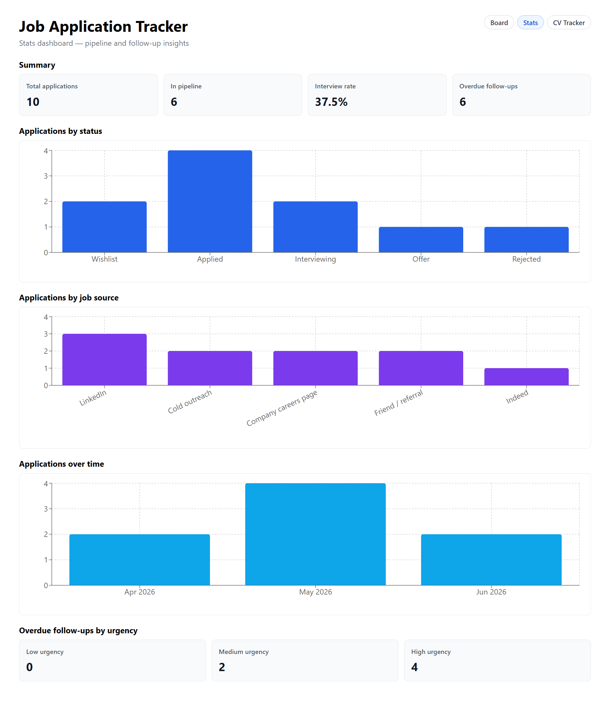
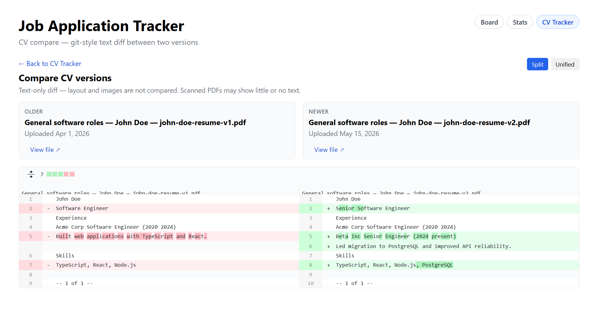

# Job Application Tracker

A full-stack **job-search tool** (React + TypeScript + Node.js) and a hands-on **Cursor AI squad** portfolio piece.

Use it to track applications on a kanban board, manage CV versions, compare resume diffs, and review pipeline stats. The repo also documents how a multi-role AI agent squad built and governed the project — with role charters, Reviewer gates, and an append-only [decision log](docs/decisions.md).

These [`.cursor/rules/`](.cursor/rules/) are intentional: they show how I constrain AI agents on real work. New agent sessions: see [`START_SQUAD.md`](START_SQUAD.md) — minimal prompt: *"You are the Lead. Execute the current step."*

## Quick tour

| Area | What you get |
|------|----------------|
| **Board** | Kanban drag-and-drop, detail modals, follow-up overdue badges, CV links |
| **Stats** | Pipeline charts, job-source breakdown, follow-up urgency counts |
| **CV Tracker** | Versioned PDF/DOCX profiles, in-app viewer, application linking |
| **CV Compare** | Git-style text diff between any two versions |

| Board | Stats | CV Compare |
|-------|-------|------------|
|  |  |  |

*Screenshots use fictional John Doe demo data (`npm run seed:demo`).*

## Run locally

**Requirements:** Node.js 20+

```bash
npm install
npm run dev
```

(`dev:backend` builds `shared/` first, then starts the API.)

- Backend: http://localhost:3001
- Frontend: http://localhost:5173 — board (`/board`), stats (`/stats`), CV Tracker (`/cvs`), viewer (`/cvs/view/:versionId`), compare (`/cvs/compare?from=&to=`)

### Demo data

For README screenshots or a clean sandbox **without your real applications or CVs**:

```bash
npm run seed:demo   # copies fictional data from backend/demo/ → backend/data/
npm run seed:demo -- --force   # required if real user data is detected
npm run dev
```

Fictional resume content uses **John Doe**. Demo sources live in [`backend/demo/`](backend/demo/) (committed). Runtime data in `backend/data/` stays gitignored. If real data is present, `seed:demo` aborts unless you pass `--force`; it saves a `pre-seed-demo-*` safety copy first.

To reset to the minimal first-run seed instead, stop the backend and delete `backend/data/applications.json` (and CV files if needed).

**Persistence:** applications in `backend/data/applications.json`; CV metadata in `backend/data/cv-profiles.json`; files in `backend/data/cvs/`. Override paths with `APPLICATIONS_DATA_FILE`, `CV_METADATA_FILE`, or `CVS_DATA_DIR` (used by tests).

### Data backup and export

While the backend is running, changes to applications or CVs trigger an **auto snapshot** (60s after the last write) into `backend/data/backups/latest/` — one rolling backup that replaces the previous copy.

| Command | Purpose |
|---------|---------|
| `npm run backup` | Snapshot now into `backups/latest/` |
| `npm run backup:list` | List `latest/` and any `pre-*` safety folders |
| `npm run backup:restore` | Restore from `latest/` (**stop the backend first**) |
| `npm run backup:restore -- pre-seed-demo-…` | Restore from a named safety folder |
| `npm run export:excel` | Write `backend/data/exports/applications-{date}.xlsx` |

Custom Excel path: `npm run export:excel -- --output path/to/file.xlsx`

You can also ask the agent in Cursor to run backup, restore, or export for you. Safety snapshots (`pre-seed-demo-*`, `pre-restore-*`) are kept until you delete them manually.

Other scripts: `npm run build`, `npm test` (Vitest), `npm run generate:demo-pdfs` (regenerate demo PDFs).

## API (backend)

- `GET /health` → `{ "status": "ok" }`
- `GET /applications` → `Application[]`
- `GET /applications/:id` → `Application` or 404
- `POST /applications` → create (body: `company`, `role`, optional `status`, dates, `link`, `jobSource`, `description`, `notes`, `contacts`, `cvProfileId`)
- `PATCH /applications/:id` → partial update
- `DELETE /applications/:id` → 204 or 404
- `GET /applications/follow-ups` → `{ "reminders": [...], "asOf": "YYYY-MM-DD" }` (optional `?asOf=YYYY-MM-DD`)
- `GET /cv-profiles` → `CvProfileSummary[]`
- `POST /cv-profiles` → multipart create (description + PDF/DOCX file)
- `PATCH /cv-profiles/:id` → update description
- `POST /cv-profiles/:id/versions` → upload new version
- `GET /cv-profiles/:id/versions` → version history with reference counts
- `GET /cv-profiles/:id/applications` → linked applications
- `GET /cv-versions/:id/applications` → applications using that version
- `GET /cv-versions/compare?from=:id&to=:id` → `CvVersionCompareResult` (text diff)
- `GET /cv-versions/:id/file` → inline file (`?download=1` forces download)
- `DELETE /cv-versions/:id` → 204 or 409 if referenced

Production deploy would need a reverse proxy from the frontend to the API (Vite proxies `/api` in dev only).

## Repo layout

| Path | Purpose |
|------|---------|
| `shared/` | Shared TypeScript types |
| `backend/` | Node + Express API + JSON file persistence |
| `backend/demo/` | Fictional demo snapshot for screenshots (`npm run seed:demo`) |
| `frontend/` | React + Vite UI (`@dnd-kit/core`, `react-router-dom`, `recharts`) |
| `.cursor/rules/` | Squad role charters + workflow (always-loaded overview) |
| `docs/decisions.md` | Append-only squad decision log |
| `PLAN.md` | Learning roadmap and squad design |
| `STATUS.md` | Current step and what's next |

## Squad

7 roles: Lead, Architect, Backend, Frontend, Tester, Reviewer, Scribe. Workflow auto-loads via [`.cursor/rules/squad-overview.mdc`](.cursor/rules/squad-overview.mdc).

## License

[MIT](LICENSE)
